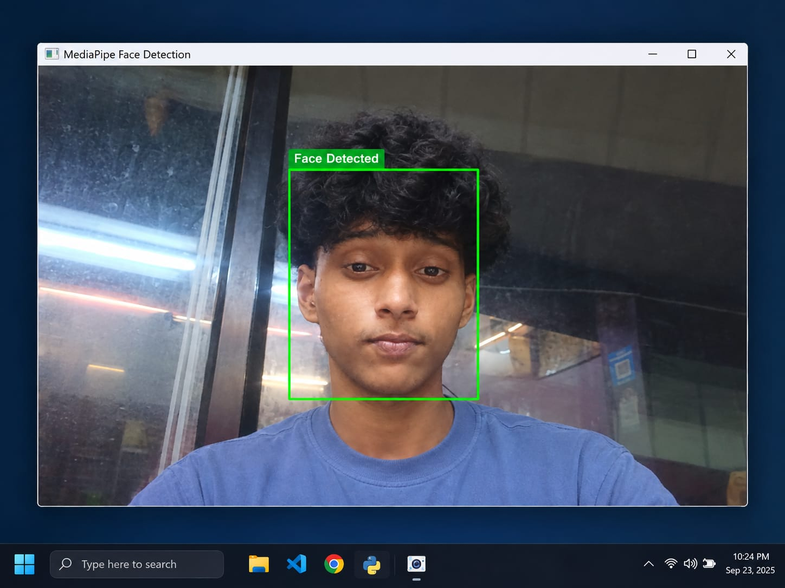

# MediaPipe Face Detection

A beginner-friendly computer vision project that uses **Python, OpenCV, and MediaPipe** to detect faces in real time using a webcam.

## 📌 About

This project captures live video from a webcam and uses MediaPipe's Face Detector to identify faces in each frame.

A bounding box is drawn around each detected face using OpenCV.

## 🚀 Features

* Real-time webcam face detection
* Face detection using MediaPipe
* Bounding boxes around detected faces
* Simple OpenCV-based display
* Beginner-friendly implementation

## 🛠️ Technologies Used

* Python
* OpenCV
* MediaPipe

## 📂 Project Structure

```text
mediapipe-face-detection/
│
├── face.py
├── README.md
├── requirements.txt
├── .gitignore
│
├── models/
│   └── blaze_face_short_range.task
│
└── images/
    └── demo.png
```

## ⚙️ Installation

Install the required Python libraries:

```bash
pip install -r requirements.txt
```

## ▶️ How to Run

Run the program:

```bash
python face.py
```

Make sure your computer has a working webcam.

The program will open a camera window and draw a bounding box around detected faces.

Press **Q** to exit.

## 🧠 How It Works

1. The webcam captures a live video frame.
2. OpenCV reads the frame.
3. The frame is converted into RGB format for MediaPipe.
4. MediaPipe's Face Detector processes the image.
5. Detected face coordinates are obtained.
6. OpenCV draws a bounding box around each detected face.
7. The processed frame is displayed on the screen.

## 📸 Demo

Add a screenshot of the program working:

```markdown

```

## 🔮 Future Improvements

* Detect multiple faces with labels
* Display detection confidence
* Add face tracking
* Add face counting
* Combine face detection with emotion detection
* Improve the user interface

## 📚 Learning Outcome

This project was created to understand the basics of real-time face detection using computer vision.

It helped me learn how to work with webcam input, OpenCV image processing, MediaPipe's Face Detection solution, and bounding boxes.

## ⚠️ Note

This project performs face detection only. It does not identify or recognize individual people.
